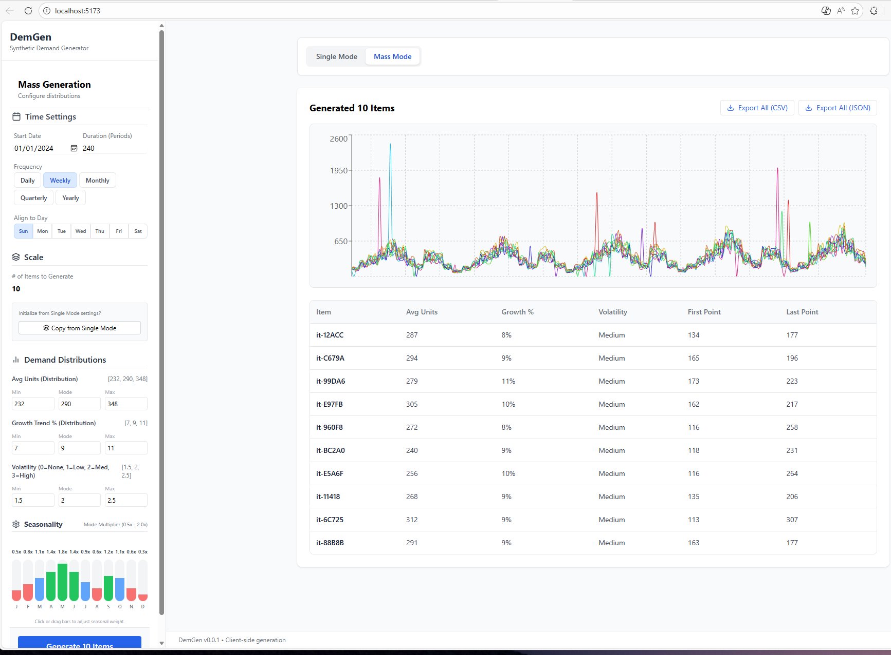

# DemGen MVP

**DemGen** is a powerful client-side synthetic time series generator designed for testing forecasting models, demand planning tools, and data visualizations.

It allows you to generate realistic demand patterns with configurable seasonality, trends, volatility, and anomalies—all in your browser.



## Features

### 🎯 Single Mode (Interactive)
Visualize and fine-tune a single demand curve.
- **Visual Editor**: Interactive chart with point-click overrides.
- **Seasonality Equalizer**: Drag-and-drop bars to set monthly weights (supports filtering/masking with 0 values).
- **Business Patterns**: Configure weekend boosts and store hours.
- **Realism Engine**: Inject random anomalies like stockouts, spikes, and data errors.
- **Segments**: Apply different growth rates or volatility to specific time ranges (e.g., "Summer Promotion").

### 🏭 Mass Mode (Bulk Generation)
Generate datasets for thousands of SKUs instantly.
- **Distributions**: Define min/mode/max for Average Daily Units, Growth Rate, and Seasonality.
- **Intelligent Hashing**: Generates consistent, unique IDs (`it-{hash}`) for reproducible datasets.
- **Parity**: Supports full feature set including seasonality masks and strict zero volatility.

### 💾 Export
- **Formats**: CSV (Wide format) and Hierarchical JSON.
- **Client-Side**: All data is generated locally in your browser. No server required.

## Getting Started

### Prerequisites
- [Node.js](https://nodejs.org/) (v16+)

### Installation

1.  Clone the repository:
    ```bash
    git clone https://github.com/yourusername/demgen.git
    cd demgen
    ```

2.  Install dependencies:
    ```bash
    npm install
    ```

3.  Start the development server:
    ```bash
    npm run dev
    ```

4.  Open your browser to `http://localhost:5173`.

## Usage Guide

### Configuring Seasonality
- Use the **Seasonality** panel to adjust monthly weights.
- Drag a bar to **1.0x** for neutral demand.
- Drag to **0.5x** to simulate low season.
- Drag to **0** to mask demand entirely for that month (value = 0).

### Volatility Settings
- **None**: Perfectly smooth trend (useful for baselines).
- **Low/Med/High**: Adds random noise.
- **Anomalies**: Enable to inject random outliers. Note: "None" volatility automatically disables anomalies.

## License

MIT License - feel free to use this for personal or commercial projects.
